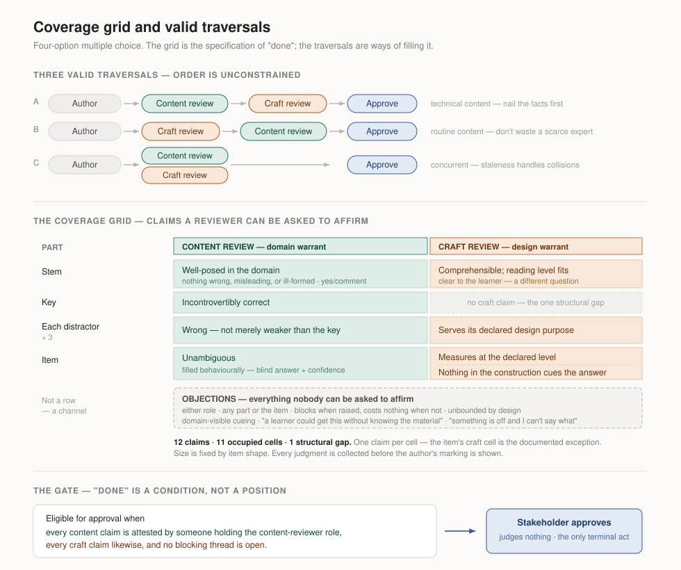

# Claims — What Each Reviewer Is Asked to Judge (Track A)

> **Answers:** *For one item, exactly what claim does each reviewer see, who is asked for it, in
> what order, and what does it cost?*

**This document is the specification of "done."** ADR-0008 makes approval eligibility a predicate
over the grid below; this is the grid. Superseded reasoning lives in
`../journal/claims-model-history.md`, not here.

**[settled]** = decided here. **[proposed]** = recommendation, open.

---

## The governing principle

> **The same part carries a different claim depending on who is looking.** A surface that asks one
> role for another role's judgment gets an answer it should not trust.

Every error this design has corrected has been a **role error** — a judgment routed to someone
whose position makes it unavailable — never a category error. The grid below is what that
principle produces when applied to one item.

*How the model reached this point, including the seven-judgment list it replaced, is in
`../journal/claims-model-history.md`.*

---

## The grid **[settled — ADR-0009]**

| Part | Content review | Craft review |
|---|---|---|
| Stem | Well-posed in the domain | Comprehensible; reading level fits the learner |
| Key | Incontrovertibly correct | **—** |
| Each distractor | Wrong — not merely weaker than the key | Serves its declared design purpose |
| Item | Unambiguous *(filled behaviourally)* | Measures at the declared cognitive level **·** Nothing in the construction cues the answer |

For a four-option item: **twelve claims across eleven occupied cells.** With the conditional
row removed, that count is fixed by the item's shape — type and option count — and no longer
varies with what the author declared.

**Consequences**

- **A cell holds one claim by default.** The item's craft cell is the documented exception: it
  holds two independent claims — the cognitive-level claim and cueing — and confirming one says
  nothing about the other. That exception is the price of cueing's relational nature, not a
  general licence for multi-claim cells. Attestation is per claim, never per cell
- **One structural gap: the key under craft review.** A key's correctness is purely a domain
  question. *"Unexamined"* and *"not applicable"* must still not render alike, but that now
  matters for one cell rather than half the grid
- **Both reviewers touch nearly every part.** The role split does not reduce the total number of
  judgments — it routes them to people qualified to make them. Twelve claims per item is *more*
  than the original seven-judgment model implied, spread across two people who each find their
  half tractable
- **The grid's size is fixed by item shape.** Nothing in the grid depends on what the author
  declared, which simplifies estimation, rendering, and ADR-0008's predicate
- **Some claims are filled by behaviour, not by gesture** — see *Item — unambiguous* below

---

## Affirmable claims and objections **[settled — ADR-0010]**

The grid holds only what a reviewer can be asked to *affirm*. It is not — and should not try to
be — a list of every reason an item might be blocked.

| | **Affirmable claim** | **Objection** |
|---|---|---|
| Shape | A cell in the grid | An open channel: any part, either role |
| Gate | Must be positively confirmed before approval | Blocks approval when raised; costs nothing when not |
| Bounded | Yes — finite, enumerable, fixed by item shape | No — unbounded by design |
| Test | Would a competent reviewer confirm this, and is their confirming it evidence? | — |

**Why the split is needed.** Three problems that looked unrelated are one problem: a judgment a
reviewer can responsibly *raise* but not responsibly *certify*.

- Whether learners actually hold a given misconception — knowable in the negative by an expert,
  rarely evidenced in the positive
- Domain-visible cueing — an expert may spot a particular cue, but nobody can attest that
  *nothing* cues
- The genuinely messy objection that fits no cell — the reason real item review is untidier than
  any grid implies

Forcing these into cells puts confirm-shaped controls in front of reviewers who have no basis
for confirming. That is worse than their absence: it manufactures attestations.

**Consequences**

- **Completeness is the channel's job, not the grid's.** The grid answers *what must be
  affirmed*; the channel answers *what else is wrong*. Asking the grid to be exhaustive was a
  category error, and the source of a persistent unease about it
- **The objection channel is load-bearing and must be designed, not assumed.** It has so far
  been named once, in passing, while carrying a great deal of quiet weight
- **An unused channel must cost nothing.** If raising an objection is expensive, the split
  fails — objections migrate back into the cells as unexplained non-confirmations
- **Objections and attestations decay differently.** An attestation is invalidated by the next
  edit; an objection stands until it is resolved or withdrawn

### An open channel still needs scaffolding **[settled]**

Openness is not neutrality. Offering no guidance is itself a design decision, and it produces
predictable under-reporting from exactly the reviewers with the most to say and the least
practice saying it. Two failures recur in real review:

- **The inarticulate signal.** A reviewer feels something is wrong with the item as a whole and
  cannot name what. Expert unease is real evidence, and it is routinely lost, because a channel
  that asks *what* is wrong reads as a demand for a diagnosis
- **The unconsidered angle.** A reviewer never thought to ask whether the stem gives away the
  answer — and is immediately useful once asked. Nothing was missing but the question

These want opposite things, and the design must serve both without letting the second consume
the first.

**Three rules**

- **The unlocalised objection is valid.** *"Something is off and I can't say what"* must be
  fileable, blocking, and attached to nothing narrower than the item. A channel that demands a
  category or a diagnosis discards the signal it most needs
- **Prompts have no state.** A prompt asks for attention; a claim asks for judgment and records
  an attestation. Nothing records that a reviewer saw a prompt, and nothing is completed by
  reading one. The moment prompts acquire state they are a checklist — and a checklist of things
  nobody can affirm is the failure this section exists to prevent
- **The list is never exhaustive and must not read as one.** Prompts narrow attention as well as
  direct it. A list that appears complete converts *"none of these"* into *"nothing wrong,"*
  closing the channel it was meant to open. An explicit unlisted option is not optional

**What the prompts say, and where they appear, is a `review-experience.md` question.** They are
surface; they are role-scoped, since content and craft attend to different things, and possibly
type-scoped. What belongs here is the constraint: prompts inform, claims attest, and the two must
never be made to look alike.

**Unresolved.** An unlocalised objection cannot be routed to a part, cannot be cleared by a
targeted edit, and probably needs a conversation rather than a fix. Who resolves it, and how, is
a `process-model.md` question.

Recorded as **ADR-0010** — it changes what "the grid" means, from *everything that must be true*
to *everything that must be affirmed*.

---

## Content review — parts and claims **[settled]**

Every claim is written as the reviewer will see it. The claim sentence is the interface; if it
cannot be written plainly, the part is not real.

### Withholding the marking is the default **[settled]**

> **Collect the reviewer's judgment before showing the author's marking.**

A default carrying a lot of value, not a rule that cannot be broken — and this document already
holds its legitimate exception. MultipleChoice reveals the key before its distractor claims,
because *"A is wrong — not merely weaker than B"* cannot be written without naming B. So the
blind answer is collected first, in its own stage, and the reveal follows.

That gives the test for breaking the default: **the claim cannot be written without naming the
author's answer.** MultipleChoice passes it. MultipleSelect and TrueFalse did not — their claims
read *"correctly marked as"* and *"as marked"*, revealing the answer for no reason beyond nobody
having looked. Four words each. The violation lived in claim wording rather than in process
design, which is why it went unnoticed while the process around it was argued over in detail.

**The blind judgment need not have the same shape as the claim it precedes.** Where collecting
the claim itself blind would be too costly or too unreliable, a cheaper *proxy* judgment
satisfies the default just as well: what matters is that the reviewer commits to something
before the marking appears. The cognitive-level claim works this way — a one-gesture binary
stands in for a six-way classification nobody performs reliably. This is what keeps the default
affordable rather than aspirational.

Worth stating because it generalises past this document: any future item type can be checked
against it, and the check is mechanical.

### MultipleChoice — 4 options, key = B

| # | Part | Claim shown to the reviewer |
|---|---|---|
| 1 | Stem | This question is well-posed: nothing here is wrong, misleading, or ill-formed. |
| 2 | Key — B | B is incontrovertibly correct — not merely the strongest of these four. |
| 3 | Distractor A | A is wrong — not merely weaker than B. |
| 4 | Distractor C | C is wrong — not merely weaker than B. |
| 5 | Distractor D | D is wrong — not merely weaker than B. |
| 6 | Item | *Filled by the blind-answer stage. Not asked.* |

**The stem claim is yes/comment, not yes/no.** *Well-posed* is where a domain expert's holistic
read lands: accidental trick questions, absurd premises, a second defensible answer, phrasing
that misleads only someone who knows the field. Every fact in a stem can check out while the
question is still broken, and fact-checking is the smallest thing an expert is for. Confirmation
is the affirmable half; anything else the reviewer wants to say goes to the objection channel.
Expect this cell to draw more comment than a fact-check would, and count that as the point.

**On "not merely weaker."** The most common latent defect in a multiple-choice item is a
distractor defensible under some reading. A reviewer asked *"is A incorrect?"* will confirm if A
is worse than B. A reviewer asked *"is A wrong, not merely weaker?"* has to consider whether a
knowledgeable learner could argue for it. Six words of copy carrying real diagnostic load — and
the clearest example of why this document's output is reviewer-facing prose, not a data model.

### Item — unambiguous, filled behaviourally **[settled]**

Not a question. The reviewer answers the item blind and marks confidence *sure* / *unsure*;
**correct-but-unsure is the ambiguity signal.**

Asking directly fails twice over. After the key is revealed, ambiguity is invisible — knowing
the intended answer is what hides it. And a reviewer asked to introspect about ambiguity gives
worse evidence than one whose hesitation is simply observed.

**What fills Item × Content.** The cell is filled behaviourally by this stage; the triviality
affordance and the open objection channel sit alongside it. The cell is one claim, but the stage
is not the only thing the item level can carry.

### The same stage carries a triviality affordance **[settled]**

Beside the confidence control, one optional affordance:

> **"A learner could get this without knowing the material."** — plus free text.

**It is an objection, not a claim.** Nobody can be asked to affirm that an item is *not*
trivial; that cell would resolve to *confirm* on nearly every item, which is the
reflexive-confirmation failure rejected for the cognitive-level content half below. Raising it
blocks approval; skipping it costs nothing, and the rest of content review proceeds either way.

**It is not a third confidence option.** Confidence reports the reviewer's own state;
triviality appraises the item. On one control they collide: an item marked trivial loses its
sure/unsure reading, and *sure* quietly comes to mean "sure **and** not trivial" — shifting the
ambiguity denominator with no one the wiser. Trivial items are precisely the ones that would
otherwise return *sure*, so the loss is concentrated rather than scattered. The wording of the
three options also refuses to go parallel, which is the surface symptom of the same fault.

**Why the label is long.** *"Too easy"* reads faster and invites the reviewer to report their
own expertise — an expert finds most items in their field easy. Naming the learner forces a
projection that partly counteracts the blind spot. The free text is there because *trivial*
covers three different defects — too easy for this audience (content), guessable without the
material (craft), and easy-to-this-expert (noise) — and which one reviewers mean should be found
from what they write rather than decided now.

**Its unit of capture is not its unit of interpretation. [settled]** Expert-blind-spot noise is
roughly constant across items, so it cancels in aggregate. One trivial objection is mostly a
fact about the reviewer; a high rate across a bank is a fact about the bank.

| Level | Surfaces to |
|---|---|
| One item | The **author**, as feedback. Not in the stakeholder's approval summary — it is not an approval-relevant fact about that item |
| Assignment or bank | The **rate**, in the stakeholder summary. This is the approval-relevant fact, and it is a property of the bank |

Captured per item, meaningful per bank, deliberately suppressed in between. Nothing else in this
model behaves that way, and the general shape — *a signal whose unit of capture differs from its
unit of interpretation* — is a toolkit candidate.

**[deferred]** What rate should concern a stakeholder belongs in `process-model.md`. Naming a
number here would be the same invented precision this document withdraws further down.

**As a cueing signal, it is weak.** It partially patches the trap recorded below — a cued
reviewer may well experience the item as easy — but only partially: an expert who answers
correctly cannot tell knowing the content from having been told it. A trivial objection is weak
one-way evidence of possible cueing, and its absence is no evidence at all. Capture it; do not
rely on it.

### What the stage reads, compounded **[settled]**

The stage collects three facts: whether the reviewer answered correctly (the system's), their
confidence (theirs), and whether they raised triviality (theirs, optional). The readings:

| Answer | Reviewer signal | Reads as |
|---|---|---|
| Correct | sure, nothing raised | Clean. The stage's null result |
| Correct | **unsure** | **Ambiguity** — the stage's founding signal |
| Correct | **trivial** | The item may not test what it claims. Weak per item, meaningful as a rate |
| Incorrect | unsure | Ambiguity, more loudly |
| Incorrect | sure | The key or a distractor is contestable — an expert confidently chose otherwise |
| Incorrect | **trivial** | **The strongest reading the stage produces.** See below |

**Incorrect-and-trivial.** A reviewer who judged the item gettable *without* the material and
then got it wrong is reporting a defect they cannot see. The two halves contradict each other on
their face, and the contradiction is what makes the compound diagnostic: the likeliest
explanations are a miskeyed item, or an option set that misleads precisely the people who know
the domain. It is not a fourth control and costs nothing — it falls out of two signals already
being captured.

Rare by construction, which is the point. A signal that fires often measures the corpus; one
that fires almost never is worth stopping for when it does.

**These are readings, not verdicts.** Any incorrect answer may simply be the reviewer erring.
The cell goes unfilled and the item returns to the author to be looked at; nothing here declares
a defect on its own. What an unfilled cell costs, and whether one reviewer's *unsure* is enough
to hold an item, is a `process-model.md` question.

**Storage consequence.** Correctness, confidence and the triviality objection must be retained
as three separate facts. Collapsing them into a single pass/fail at capture destroys every
compound in this table, and the compounds are where the diagnostic value is.

### MultipleSelect — n options

| # | Part | Claim |
|---|---|---|
| 1 | Stem | This question is well-posed: nothing here is wrong, misleading, or ill-formed. |
| 2…n+1 | Each option | *Mark this option* **correct** / **incorrect**. Compared afterwards to the author's marking. |
| + | Item | *Filled by the set comparison. Not asked.* |

Options are not split into key and distractors, because the marking is what is under test —
and under blind marking that is literally true.

**No separate blind-answer stage, because the option markings already are one.** A MultipleSelect
item's blind answer *is* the set the reviewer marks. Comparing it to the author's set yields
everything the MultipleChoice stage yields, at better resolution: a mismatch names the contested
option, where a wrong MultipleChoice answer names only the distractor that drew the reviewer.

Gesture count is unchanged — *n* markings either way. What changes is that the reviewer decides
rather than agrees. That is a real increase in cognitive cost, of the same kind accepted for the
stem claim above, and it is what makes the evidence worth having.

**Confidence is collected once, at item level, after the set is marked.** Per-option confidence
would spend *n* gestures recovering a signal the mismatch already localises.

**A cost to watch, not to solve now.** If experts routinely differ from authors on one option in
five, MultipleSelect generates objections at several times the rate of MultipleChoice, which
would make the type structurally expensive to review. That is an argument about item-type policy
rather than about the interface, and Phase 4 should measure it before anyone argues it.

### TrueFalse

| # | Part | Claim |
|---|---|---|
| 1 | The statement | *Answer:* **true** / **false**. Compared afterwards to the author's marking. |

**One part.** The stem *is* the claim. That the model scales down to a single judgment without
deforming is evidence it tracks something real.

**Here the stage and the claim are the same act.** The earlier wording — *"true / false, **as
marked**"* — showed the author's answer and asked for agreement, which is the acquiescence
problem the blind-answer design exists to defeat, sitting inside a one-row table. Collected
blind, nothing is added: the same single gesture, unprimed.

**The 50% floor is real and has to be stated.** With two options, *correct-but-unsure* is
confounded with a coin flip, so this type's founding signal is weak. The other readings hold or
strengthen:

| Reading | For TrueFalse |
|---|---|
| Correct + unsure | **Weak.** Chance explains it |
| Incorrect | **Strong.** An expert disagreeing with a binary marking is close to a direct report of miskeying |
| Trivial raised | **The type's characteristic failure.** At a 50% base rate, guessability is the dominant defect mode of TrueFalse |

That last row is where the rate reading earns its keep. A bank of TrueFalse items with a high
trivial rate is reporting that the type was the wrong choice — a more useful finding than
anything available per item.

---

## Craft review — parts and claims **[settled]**

The craft reviewer judges what the author **declared**.

| Part | Claim |
|---|---|
| Stem | Comprehensible; the reading level fits the intended learner. |
| Each distractor | This distractor would catch someone reasoning the way its declared purpose says. |
| Item | This item measures at the declared cognitive level. |
| Item | Nothing in the item's construction cues the answer. |

### The cognitive-level claim is collected in two steps **[settled]**

The withhold-the-marking default applies: the declared level is not shown until the reviewer has
committed to something.

1. **Blind, one gesture** — *"Does this item require more than recall?"*
2. **Reveal** the declared level
3. **Confirm** the claim — *This item measures at the declared cognitive level.*

Hiding the declaration through step 1 costs nothing, and it stops the reviewer from answering
out of the author's answer. Why step 1 is a binary rather than a level is argued below.

**Declarations and confirmations are different acts.** The author's declaration of a distractor
purpose creates durable rationale that outlives the item; the craft reviewer's confirmation
creates a local attestation a later edit invalidates. They must not look alike in the form.

---

## The distractor-purpose claim splits between declaration and review **[settled]**

A declared purpose makes up to two separable claims:

| Claim | Kind | Whose |
|---|---|---|
| "This text would catch someone reasoning this way" | Design | **Craft review** confirms it |
| "Learners actually reason this way" | Empirical, about the domain | **The author** asserts it by declaring the purpose |

The empirical half was previously a content-review cell. It is not one. Nobody can responsibly
attest that learners hold a given misconception: the learning research does not exist at that
granularity in most domains, and what an experienced expert actually holds is strong anecdote.
A confirm control there does not collect evidence — it manufactures it.

Declaring a diagnostic purpose *is* the empirical assertion. It is already durable, already
attributed, already captured in `rationale-capture.md`. Review's part is to contest it, never to
confirm it — the clearest instance of the affirmable/objection split above.

Which purposes carry an empirical assertion at all is predicted by the vocabulary in
`rationale-capture.md`:

- **Diagnostic** — misconception, prerequisite gap, procedural error, partial understanding,
  surface-plausible, outdated knowledge. All assert something about learners, and all are
  therefore contestable
- **Structural** — difficulty tuning, filler, domain sampling. No empirical assertion, nothing
  for a domain expert to contest

The mechanism from `rationale-capture.md` survives — *"the reviewer sees the declared purpose
before judging it; self-report is weak evidence, contested self-report is strong"* — but only
its contesting half operates here. Uncontested self-report gains nothing from being shown to
someone who has no way to check it.

---

## Cueing is a craft claim and a content objection **[settled — ADR-0009, ADR-0010]**

Cueing is not a content *claim*. Neither is it absent from content review.

**Three reasons it sits where it does**

1. **It has no part to anchor to.** Cueing is a property of the stem *against the option set*.
   The stem alone is unobjectionable; no single option is at fault. It is relational, where
   every other part is componential — so it sits at the item level
2. **Its catalogued forms are construction defects.** Grammatical agreement leaking the answer,
   the key conspicuously longest or most qualified, absolute terms marking the distractors, stem
   wording echoed in the key, two options that converge. *The catalogue is incomplete — below*
3. **The blind-answer instrument cannot detect it.** A domain expert who answers correctly cannot
   distinguish knowing the content from having been told it. **This bounds the instrument, not the
   role.** Introspection is not inspection: a reviewer who cannot tell from *answering* whether
   they were cued can still see a cue by *reading*

### Taxonomic cueing — the class craft review cannot see

A stem asks *"Which widget is best for…"* and only one option is a widget; the rest are other
kinds of dohickey. The item is answerable by category membership alone, without any of the
reasoning it claims to test. The author's error was not construction but **classification** —
they did not hold the domain's category structure.

Every catalogued form is syntactic or rhetorical: grammar, length, absolutes, lexical echo,
convergence. All are visible *without* knowing the subject, which is what makes them construction
defects. Taxonomic cueing is invisible *without* it — so the catalogue is incomplete in precisely
the direction craft review cannot cover.

**And no part-level claim can catch it.** Asked *"is A wrong — not merely weaker than B?"* about
a non-widget, the content reviewer confirms, correctly: a non-widget is certainly wrong. Every
part-level claim is satisfiable while the item is broken. That is what reason 1's *relational, not
componential* costs in practice: **no cell in either column can hold a relation.**

### Where domain-visible cueing goes **[settled]**

Not into a content cell. *Nothing cues* is a negative universal over a class whose holder cannot
bound it; nobody can certify the absence of cueing. That is the affirmable/objection test applied
above, and cueing fails it.

It is an **objection** — raised by the content reviewer when seen, silent when not, blocking when
raised. **No new affordance is needed.** Unlike triviality, this signal is not perishable: a
taxonomic cue is as visible during the distractor walk as at any other moment, so the general
channel carries it at no added cost. That is the second problem the objection channel has
absorbed which would otherwise have become a control.

**The craft claim narrows accordingly.** *"Nothing in the stem or option set cues the answer"*
overclaims — the craft reviewer can speak only to the forms they are equipped to check.
Restated:

> **Nothing in the item's construction cues the answer.**

Bounded, checkable, and honest about what it leaves out.

**A ceremony risk, recorded.** Even narrowed, this cell will confirm on most items — the shape
this document distrusts everywhere else, and the same risk recorded for the cognitive-level cell.
The mitigation is the same: keep the check specific rather than a vague global negative, with the
lint running the highest-precision forms and the reviewer speaking to the residue — and delete
the cell if it never fails in use.

### The trap worth recording

**The blind-answer stage cannot catch cueing**, and it looks as though it should.

It detects *ambiguity*: a reviewer who picks a distractor, or hesitates. But cueing makes the
item **easier**. A cued reviewer answers correctly and confidently, and the stage scores that as
a pass. The two failure modes point in opposite directions and the instrument reads only one.

So cueing needs a craft-side home, and it has one.

### On automated checks — scope, honestly **[proposed]**

An earlier draft called cueing "machine-detectable," which overstated it. The move to craft
review stands on its own; the lint was never the justification.

**Computable, reasonable precision:**

- **Grammatical agreement** — a stem ending in "an" eliminating consonant-initial options;
  singular/plural agreement. Narrow and reliable
- **Absolute-term asymmetry** — "always / never / all / none" in distractors but not the key.
  Word-list based, brittle but cheap
- **Length asymmetry** — key longer than the distractor mean. The best-documented flaw in the
  item-writing literature, computable exactly — but correct answers are often legitimately
  longer because precision needs qualification. Flags, never fails
- **Stem-key lexical overlap** — an uncommon term shared by stem and key but no distractor.
  Moderate precision at best
- **"All / none of the above"** — trivial to detect; whether it is a defect is house style

**Not computable:** whether a distractor is factually wrong; whether a stem is ambiguous;
whether the cognitive-level claim holds; convergence cueing; whether a distractor is plausible.
All need meaning, not syntax.

**The design constraint is alarm fatigue.** A lint that fires on half the items and is usually
wrong is worse than none, because the dismissal ritual creates false confidence in coverage. So:

- Ship the **two** highest-precision checks. Not six
- **Every dismissal requires a reason**, which makes the lint measure itself. A check dismissed
  80% of the time is noise and gets deleted — found from data rather than argued about

**[proposed]** No LLM in this loop for now. It would catch more, and its failure mode is
confident wrong flags — alarm fatigue with better prose. Revisit once the syntactic checks have
a measured cost.

---

## The cognitive-level claim is a craft judgment **[settled]**

Not a content-review cell. A domain expert asked to name the Bloom's level an item measures is
being asked for a taxonomy most have never used and have no reason to have used — structurally the
same role error as cueing.

**That reason does not carry over to craft review.** The craft reviewer is an instructional
designer, so taxonomy fluency is a fair assumption. What rules out blind level-naming *there* is a
different problem, and the two should not be read as one.

### Why the blind step is a binary, not a level **[settled]**

Blind naming — *"which of six levels is this?"* — converts a recognition task into a production
task, and produces disagreements nobody can read. Inter-rater reliability on Bloom's
classification is poor even among trained designers, so a mismatch carries two indistinguishable
explanations: the item does not measure at the declared level, or two competent people applied a
fuzzy taxonomy differently. A control that fires often and is frequently uninterpretable needs a
dismissal ritual — the alarm-fatigue failure rejected for lint checks below, this time with a
person inside it.

*"Does this item require more than recall?"* avoids all of it:

- **It is the one cut in the taxonomy people agree on.** Asking for no level, it inherits no
  six-way fuzz
- **It targets the endemic defect.** Banks fill with items declared at *Apply* that test recall.
  The reverse error — declared recall, actually higher — is rare and harmless
- **The signal is therefore asymmetric**, and does not flood the reviewer the way blind naming
  would
- **Its real work is inoculation.** The reviewer has committed before *Apply* appears, so the
  confirmation that follows is anchored to their own call rather than to the author's

**Required, not optional.** An optional blind step gets skipped exactly when acquiescence is
most likely, which defeats the mechanism entirely. The cost is honest: one mandatory gesture on
every item's craft review.

**The ceremony test.** If the recall mismatch rate proves near zero in use, this cell is
ceremony and should be deleted — found from data rather than argued about, on the same
discipline applied to the lint checks.

**Considered and rejected: a content half.** *"Is this item about the thing the objective
names?"* is a domain judgment a reviewer could make. Rejected because the cell would be
ceremony: an item authored against an objective is about that objective essentially always, and
a cell that resolves to *confirm* upwards of 95% of the time trains reflexive confirmation
across the whole grid. The rare genuine exception is what the objection channel is for.

---

## Interaction cost is counted in gestures, not seconds **[settled]**

**A gesture count is derivable from this specification. A time is a property of a person nobody has
watched.** One can be checked by reading this document; the other cannot be checked at all.

*The time budget this replaced, the three mutually unreachable figures that preceded it, and the
evidence that a settled table can go stale invisibly, are in `../journal/claims-model-history.md`.*

### The gesture inventory **[settled]**

Each gesture is classed by kind, not by duration:

| Class | What it is | Cost |
|---|---|---|
| **Recognition** | Shown a proposition; agree or disagree | Cheap |
| **Production** | Generate the judgment with no candidate shown | Scales with the size of the answer space |
| **Composition** | Write prose | Expensive, and unbounded |

These are not invented for the purpose. Recognition against production is what the
cognitive-level argument above already runs on — *"is this Apply?"* against *"which of six levels
is this?"* — and *production cost scales with the answer space* is precisely why the recall binary
is affordable where blind level-naming is not. The same vocabulary states the MultipleSelect cost
without inventing seconds: blind marking is *n* productions where confirmation was *n*
recognitions.

| | Required gestures | Production | Composition |
|---|---|---|---|
| Content, MultipleChoice-4 | 6 | 1 (4-space) | Expected on the stem claim; not required |
| Content, TrueFalse | 2 | 1 (2-space) | — |
| Content, MultipleSelect-*n* | *n* + 2 | *n* (2-space each) | Expected on the stem claim |
| Craft, MultipleChoice-4 | 7 | 1 (2-space) | — |

Optional gestures — the triviality affordance, any objection — are excluded by definition: an
unused channel must cost nothing.

**Craft review is more gestures than content review**, which is not the intuition — content
review's gestures carry domain recall that craft's do not, so gesture count and felt cost diverge.

**The limitation, stated rather than sold around.** Gesture counts deliberately omit the thing
that dominates the cost. That is also why they are the right instrument now: they isolate what
the design controls, and do not pretend to measure the rest.

### No new required gesture without naming what it buys **[settled]**

The review of this document applied the rule three times before stating it. The cognitive-level
blind step was added as *required* and had to argue for it — inoculation against acquiescence.
The triviality affordance was made *optional* precisely because it could not earn required
status. Domain-visible cueing added nothing at all, because the objection channel already carried
it.

That is the budget discipline: a constraint on the design, rather than a number to argue with.

### Seconds are a Phase 4 output, not a Phase 0 input **[settled]**

The validation plan's Phase 4 already carries a baseline condition, and real timing comes from
watching people work. The withdrawn section's underlying error was trying to derive by argument
what only measurement can settle. No numeric target is set here, and none should be set until
Phase 4 returns one.

---

## What the design controls **[settled]**

Most of what an item costs a reviewer is reading and domain recall, and **no interface compresses
it.** A budget in absolute seconds therefore mostly measures the corpus, and would fail a
well-built surface handed dense items. The claim needs no figure — one session watching a reviewer
settles it, and the fraction an earlier draft carried did not survive its derivation.

What the design controls is navigation, gesture cost, re-reading forced by layout, mode
confusion, and comment composition.

This is the same principle as the gesture inventory above, applied to time rather than to
gestures: isolate the part the design is answerable for, and do not claim to measure the rest.

### Overhead is a Phase 4 instrument, not a present metric **[proposed]**

> **Interaction overhead = (total time − irreducible content time) ÷ irreducible content time**

**The denominator is the honest part.** Phase 4's baseline condition — two or three items read as
plain text with no interface, one keypress at judgment — is a *measurement*, not an assumption,
and it is the only quantity anywhere near this budget that is not derived from something
invented.

**The numerator does not exist yet.** Total time is a Phase 4 output. Until Phase 4 runs there is
nothing to compute, which is why this section defines an instrument rather than stating a metric
now in force.

**Absolute overhead travels beside the ratio.** The measure is robust to corpus difficulty in one
direction only: hard items cannot make a good design look bad, but they readily make a bad one look
good. Thirty seconds of overhead reads as 150% on twenty-second items and 50% on sixty-second
items — harder corpus, no design improvement, better score. A ratio hides absolute cost, so the raw
seconds must be reported with it.

### No thresholds on this metric **[settled]**

> **A measure can be useful for comparison while being useless for adjudication.**
> Ranking does not need a scale. Grading does.

*"Is 62% acceptable?"* is unanswerable, and will remain so however much data arrives, because it
is a value judgment wearing a number. *"Is this revision cheaper than the last one?"* is
answerable as soon as there are two measurements, and needs no boundary at all. Overhead is
compared against the baseline and against earlier revisions of the design. Nothing is compared
against a threshold.

*The withdrawn bands are recorded in `../journal/claims-model-history.md`.*

### Which instrument answers which question

| Question | Instrument | Available |
|---|---|---|
| Did this design change add cost? | Gesture inventory diff | **Now** |
| Does the interface cost more than the thinking it collects? | Overhead, with absolute seconds beside it | Phase 4 |

---

## Open questions

- **Is "not merely weaker than B" the right wording?** Real diagnostic load, and also the
  longest claim on the screen, read three to five times per item
- **A behaviourally-filled cell is not an attestation anyone made.** Whether *item — unambiguous*
  should carry attribution, and to whom, is unresolved
- **MultipleSelect option ordering.** Under blind marking, reading the options as a set is the
  point rather than a possible defect. What remains untested is whether order shifts the
  markings, and whether the order shown to the reviewer should differ from the author's

---

## Related

- ADR-0009 — attestation per (part × review type); this document is its grid. Amended 2026-08
- ADR-0010 — the grid holds affirmable claims; everything else is an objection
- ADR-0008 — the eligibility predicate that quantifies over these claims
- `content-accuracy-validation-plan.md` — the phases; this began as Phase 0's output
- `review-experience.md` — the surfaces these claims appear on
- `rationale-capture.md` — the purpose vocabulary, and where the empirical claim about learners now lives
- `../journal/2026-08-claims-review.md` — the 2026-08 review's decision log and propagation record
- `../journal/claims-model-history.md` — superseded reasoning: what this document used to say, and why it stopped
